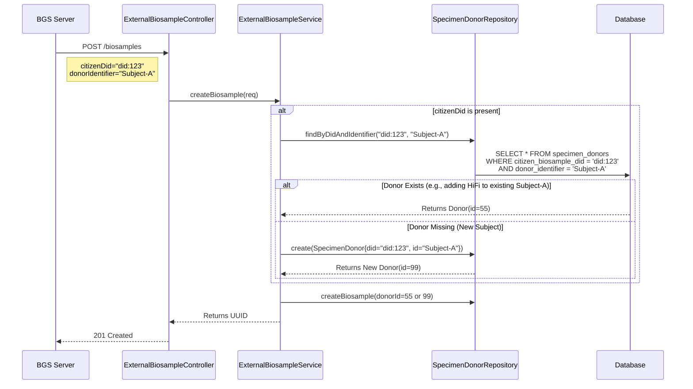

### Architecture Overview

For the MVP, we will utilize a **Secure REST API** pattern. The BGS server will act as an authenticated API client, pushing operational data directly to the `decodingus` backend.

*   **Integration Point:** `POST /api/private/external/biosamples`
*   **Controller:** `app/controllers/ExternalBiosampleController.scala`
*   **Data Model:** `app/models/api/ExternalBiosampleRequest.scala`
*   **Security:** API Key authentication via `X-API-Key` header.

### 2. Atmosphere / Citizen Sample Linking

For **Atmosphere** (Citizen) biosamples, the system must correctly place the sample within a hierarchy:
1.  **Researcher/User (PDS Owner):** Identified by `citizenDid`. A single researcher may manage multiple donors.
2.  **Specimen Donor:** Identified by a unique `donorIdentifier` within the Researcher's context. A single donor may have multiple biosamples (e.g., different tissues, or different sequencing technologies like Short-read vs. HiFi).
3.  **Biosample/Sequencing Data:** The actual data being uploaded.

*   **Linkage Keys:**
    *   `citizenDid`: Identifies the Researcher/PDS.
    *   `donorIdentifier`: Identifies the specific biological source (person) *within* that Researcher's collection.

*   **SpecimenDonor Resolution Logic:**
    The system attempts to find a `SpecimenDonor` matching **BOTH** the `citizenDid` and the `donorIdentifier`.
    *   **If Found:** The new Biosample is linked to this *existing* Specimen Donor.
        *   *Benefit:* This aggregates multiple datasets (e.g., WGS + HiFi) under the same physical donor.
    *   **If Not Found:** A new `SpecimenDonor` record is created.
        *   `citizenBiosampleDid` = `citizenDid`
        *   `donorIdentifier` = `donorIdentifier`
        *   `donorType` = "Citizen"

**Revised Sequence Diagram:**



### 1. Data Payload Specification

**JSON Structure:**
```json
{
  "sampleAccession": "BGS-UUID-12345",
  "sourceSystem": "BGS_MVP",
  "description": "Processed by BGS Node 1",
  "centerName": "DecodingUs Ops",
  "sex": "Male",
  "citizenDid": "did:plc:u76f5w...", 
  "donorIdentifier": "Subject-001",
  "donorType": "Citizen",
  "sequenceData": { 
      // ... (same as before)
  }
}
```

### 4. Rust Implementation (BGS Side)

**Suggested Rust Structs:**

```rust
use serde::Serialize;

#[derive(Serialize)]
struct ExternalBiosampleRequest {
    sampleAccession: String,
    sourceSystem: String, 
    description: String,
    centerName: String,
    citizenDid: Option<String>, 
    donorIdentifier: Option<String>, // New: Identifies specific donor
    donorType: Option<String>, 
    sequenceData: SequenceDataInfo,
    // ...
}
```

    // Handle 201 Created or errors
    Ok(())
}
```

### 5. Integration Roadmap

The integration strategy evolves through three distinct phases, moving from a simple direct connection to a robust, decentralized architecture.

#### Phase 1: Direct REST API (Current / MVP)
*   **Mechanism:** Synchronous HTTP POST.
*   **Flow:** `BGS Server` -> `DecodingUs Controller` -> `Service` -> `DB`.
*   **Pros:** Simplest to implement; immediate feedback on success/failure.
*   **Cons:** Tightly coupled; requires BGS to handle retries if DecodingUs is down.

#### Phase 2: Asynchronous Ingestion (Kafka)
*   **Mechanism:** Message Queue.
*   **Flow:** `BGS Server` -> `Kafka Topic` -> `DecodingUs Consumer` -> `Service` -> `DB`.
*   **Change:** BGS replaces the HTTP Client with a Kafka Producer. DecodingUs adds a Kafka Consumer service.
*   **Pros:** Decoupled; handles bursts of traffic; high resilience.

#### Phase 3: Decentralized AppView (Atmosphere)
*   **Mechanism:** AT Protocol Firehose.
*   **Flow:** `BGS Server` -> `Researcher PDS` -> `AT Proto Relay` -> `DecodingUs Firehose Consumer` -> `Service` -> `DB`.
*   **Change:** BGS writes directly to the user's PDS using the `com.decodingus.atmosphere.biosample` Lexicon. DecodingUs becomes a passive indexer.
*   **Pros:** True user data ownership; interoperability with other AT Protocol apps.

### Next Steps
1.  **Provision Key:** Ensure a valid API key is set in your AWS Secrets Manager (for prod) or `application.conf` (if configured for dev overrides).
2.  **Deploy BGS:** Configure the BGS MVP node with the `decodingus` URL and the API Key.
3.  **Verify:** Send a test payload from the BGS node and verify the data appears in the `biosamples` and `sequence_libraries` tables.