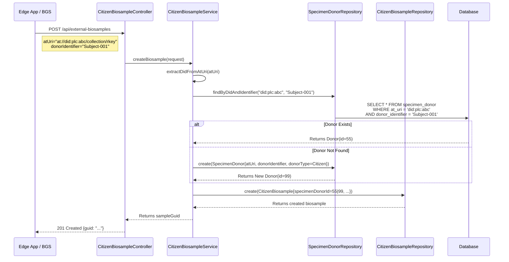

# BGS / Firehose Integration Plan

## Phase 1 Status: ✅ COMPLETE

Phase 1 (Direct REST API / MVP) implementation is complete and ready for integration testing.

---

## Architecture Overview

For the MVP, we utilize a **Secure REST API** pattern. The BGS server (or Edge App) acts as an authenticated API client, pushing operational data directly to the `decodingus` backend.

### Citizen Biosample API

*   **Integration Point:** `POST /api/external-biosamples`
*   **Controller:** `app/controllers/CitizenBiosampleController.scala`
*   **Service:** `app/services/CitizenBiosampleService.scala`
*   **Data Model:** `app/models/api/ExternalBiosampleRequest.scala`
*   **Security:** API Key authentication via `X-API-Key` header (`ApiSecurityAction`)

### Full CRUD Operations

| Operation | Endpoint | Description |
|-----------|----------|-------------|
| **Create** | `POST /api/external-biosamples` | Create new citizen biosample with donor resolution |
| **Update** | `PUT /api/external-biosamples/{atUri}` | Update existing biosample (optimistic locking via `atCid`) |
| **Delete** | `DELETE /api/external-biosamples/{atUri}` | Soft delete biosample |

### Project API

| Operation | Endpoint | Description |
|-----------|----------|-------------|
| **Create** | `POST /api/projects` | Create new research project |
| **Update** | `PUT /api/projects/{atUri}` | Update project (optimistic locking) |
| **Delete** | `DELETE /api/projects/{atUri}` | Soft delete project |

---

## Data Model: Atmosphere / Citizen Sample Hierarchy

The Edge App manages a workspace with the following hierarchy:

```
PDS Owner (Researcher running Edge App)
  └── Workspace
        ├── SpecimenDonor "Grandfather" (donorIdentifier: "Subject-001")
        │     └── CitizenBiosample (multiple sequenceData entries: WGS + HiFi)
        │
        ├── SpecimenDonor "Father" (donorIdentifier: "Subject-002")
        │     └── CitizenBiosample (WGS only)
        │
        └── SpecimenDonor "Self" (donorIdentifier: "Subject-003")
              └── CitizenBiosample (Exome + WGS from different labs)
```

### Key Concepts

1.  **PDS Owner (citizenDid):** The researcher/genealogist running the Edge App. Extracted from `atUri` or provided explicitly.
2.  **Specimen Donor:** A physical person (family member, project participant). Identified by `donorIdentifier` within the PDS owner's context.
3.  **Citizen Biosample:** A single biosample record containing multiple `sequenceData` entries (different sequencing runs, labs, technologies).

### Linkage Keys

*   `atUri`: The canonical AT Protocol identifier (`at://did:plc:xxx/collection/rkey`) - uniquely identifies the biosample record
*   `citizenDid`: Extracted from `atUri` or provided explicitly - identifies the PDS owner
*   `donorIdentifier`: Identifies the specific biological source (person) within that PDS owner's collection

### SpecimenDonor Resolution Logic

Implemented in `CitizenBiosampleService.resolveOrCreateDonor()`:

1. Extract `citizenDid` from `atUri` (format: `at://did:plc:xxx/...`)
2. Look up `SpecimenDonor` by `(citizenDid, donorIdentifier)` pair
3. If found: Link biosample to existing donor (aggregates multiple datasets)
4. If not found: Create new `SpecimenDonor` with `donorType = Citizen`



---

## Data Payload Specification

### ExternalBiosampleRequest

```json
{
  "sampleAccession": "BGS-UUID-12345",
  "sourceSystem": "BGS_MVP",
  "description": "Processed by Edge Node",
  "centerName": "Home Lab",
  "sex": "Male",
  "atUri": "at://did:plc:abc123/com.decodingus.atmosphere.biosample/rkey456",
  "donorIdentifier": "Subject-001",
  "donorType": "Citizen",
  "latitude": 40.7128,
  "longitude": -74.0060,
  "haplogroups": {
    "yDna": {
      "haplogroupName": "R-M269",
      "score": 0.998,
      "matchingSnps": 145,
      "mismatchingSnps": 2
    },
    "mtDna": {
      "haplogroupName": "H1a",
      "score": 0.995
    }
  },
  "sequenceData": {
    "reads": 850000000,
    "readLength": 150,
    "coverage": 32.5,
    "platformName": "ILLUMINA",
    "testType": "WGS",
    "files": [
      {
        "fileName": "sample.cram",
        "fileSizeBytes": 22000000000,
        "fileFormat": "CRAM",
        "aligner": "BWA-MEM",
        "targetReference": "GRCh38",
        "checksums": [{"checksum": "abc123...", "algorithm": "SHA-256"}],
        "location": {"fileUrl": "s3://bucket/sample.cram", "fileIndexUrl": "s3://bucket/sample.cram.crai"}
      }
    ]
  },
  "publication": {
    "doi": "10.1234/example",
    "originalHaplogroups": {
      "yHaplogroup": {"haplogroupName": "R1b"},
      "mtHaplogroup": {"haplogroupName": "H"}
    }
  }
}
```

### Key Fields

| Field | Required | Description |
|-------|----------|-------------|
| `sampleAccession` | Yes | Unique identifier from the Edge App |
| `atUri` | Yes* | AT Protocol URI - canonical identifier |
| `donorIdentifier` | Yes* | Identifies the physical person within PDS owner's collection |
| `sequenceData` | Yes | Sequencing run details and files |
| `haplogroups` | No | Y-DNA and mtDNA assignments with full scoring |
| `atCid` | No | For updates: optimistic locking version |

*Required for proper donor resolution

---

## PDS Registration

Before syncing data, PDS instances must be registered:

**Endpoint:** `POST /api/registerPDS`

```json
{
  "did": "did:plc:abc123",
  "handle": "researcher.bsky.social",
  "pdsUrl": "https://pds.example.com",
  "rToken": "auth-token-from-edge-app"
}
```

The registration process:
1. Verifies PDS is reachable via `com.atproto.sync.getLatestCommit`
2. Stores DID, PDS URL, and initial sync cursor
3. Enables the Rust sync cluster to poll for updates

### PDS Lease Management

For parallel sync processing, the `pds_registrations` table includes:
- `leased_by_instance_id`: Which sync worker owns this PDS
- `lease_expires_at`: Lease expiration for failover
- `processing_status`: idle | processing | error

---

## Database Schema

### Tables

| Table | Purpose |
|-------|---------|
| `citizen_biosample` | Citizen/Atmosphere biosample records |
| `specimen_donor` | Physical persons (donors) - linked via `specimen_donor_id` FK |
| `project` | Research projects grouping biosamples |
| `pds_registrations` | Registered PDS instances for sync |
| `publication_citizen_biosample` | Links biosamples to publications |
| `citizen_biosample_original_haplogroup` | Publication-reported haplogroups |

### Key Columns on `citizen_biosample`

| Column | Type | Purpose |
|--------|------|---------|
| `at_uri` | VARCHAR | AT Protocol canonical identifier |
| `at_cid` | VARCHAR | Version for optimistic locking |
| `specimen_donor_id` | INT FK | Link to physical donor |
| `deleted` | BOOLEAN | Soft delete flag |
| `y_haplogroup` | JSONB | Full HaplogroupResult with scoring |
| `mt_haplogroup` | JSONB | Full HaplogroupResult with scoring |

---

## Integration Roadmap

### Phase 1: Direct REST API ✅ COMPLETE

*   **Mechanism:** Synchronous HTTP POST
*   **Flow:** `Edge App` → `CitizenBiosampleController` → `CitizenBiosampleService` → `DB`
*   **Status:** Fully implemented and tested

### Phase 2: Asynchronous Ingestion (Kafka)

*   **Mechanism:** Message Queue
*   **Flow:** `Edge App` → `Kafka Topic` → `DecodingUs Consumer` → `Service` → `DB`
*   **Change:** Edge App uses Kafka Producer; DecodingUs adds Kafka Consumer service
*   **Benefits:** Decoupled; handles traffic bursts; high resilience

### Phase 3: Decentralized AppView (Atmosphere)

*   **Mechanism:** AT Protocol Firehose
*   **Flow:** `Edge App` → `User's PDS` → `AT Proto Relay` → `DecodingUs Firehose Consumer` → `DB`
*   **Change:** Edge App writes directly to PDS using `com.decodingus.atmosphere.biosample` Lexicon; DecodingUs becomes passive indexer
*   **Benefits:** True user data ownership; interoperability with AT Protocol ecosystem

---

## Deployment Checklist

### For Phase 1 MVP

1. **API Key:** Configure in AWS Secrets Manager (prod) or `application.conf` (dev)
2. **Database:** Run evolution 25.sql for `specimen_donor_id` FK on `citizen_biosample`
3. **Edge App Config:** Set DecodingUs API URL and API key
4. **Test:** POST sample payload to `/api/external-biosamples`
5. **Verify:** Check `citizen_biosample`, `specimen_donor`, and `sequence_library` tables

### Swagger UI

API documentation available at: `/api/docs`

Documented endpoints:
- Citizen Biosamples (Create, Update, Delete)
- Projects (Create, Update, Delete)
- References, Haplogroups, Coverage, Sequencer APIs
